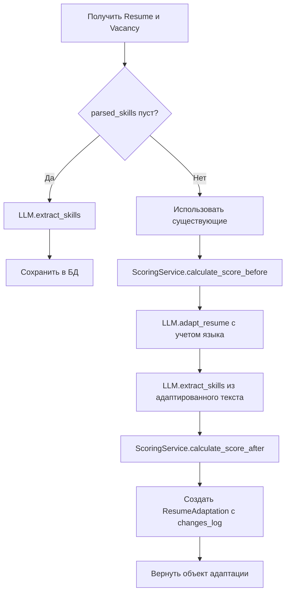

---

# 📘 Документация проекта ResumeAI

## 1. Обзор проекта

**ResumeAI** — это веб-приложение для автоматической адаптации резюме под требования конкретных вакансий с использованием LLM (через OpenRouter с моделью Llama 3.1). Система анализирует навыки из резюме и вакансии, вычисляет процент совместимости (score), адаптирует текст резюме с помощью AI и сохраняет историю изменений.

### Основные возможности
- ✅ Создание и управление резюме (CRUD)
- ✅ Создание и управление вакансиями (CRUD)
- ✅ Автоматическое извлечение навыков из текста (LLM)
- ✅ Адаптация резюме под вакансию с выбором языка (ru/en)
- ✅ Расчет совместимости до/после адаптации
- ✅ Детальный лог изменений (добавленные навыки, улучшение скора)
- ✅ REST API + React SPA фронтенд
- ✅ ATS-оптимизация

### Технологический стек

| Компонент       | Технологии                                                                 |
|----------------|----------------------------------------------------------------------------|
| Бэкенд         | Django 6.0, Django REST Framework, OpenRouter API (Llama 3.1)             |
| База данных    | SQLite3 (локально), PostgreSQL (продакшен)                                 |
| Фронтенд       | React 19, React Router 7, Axios, Bootstrap 5, CSS Modules                 |
| Аутентификация | Кастомная модель User (AbstractUser), поддержка соцсетей (заготовка)      |
| Развертывание  | Настройки для production (SSL, CORS, env-переменные)                      |

---

## 2. Архитектура проекта

```
ResumeAI/
├── ResumeAdaptation/
│   └── frontend/
│   ├── src/
│   │   ├── components/          # React компоненты
│   │   │   ├── ResumeList.js
│   │   │   ├── CreateResume.js
│   │   │   ├── VacancyList.js
│   │   │   ├── CreateVacancy.js
│   │   │   └── AdaptResume.js
│   │   ├── services/
│   │   │   └── api.js           # Axios клиент
│   │   ├── App.js               # Маршрутизация и навигация
│   │   ├── App.css              # Стили (градиенты, анимации)
│   │   └── index.js
│   ├── ResumeAdaptation/        # Django проект
│   │   ├── settings/
│   │   │   ├── base.py          # Общие настройки
│   │   │   ├── local.py         # Локальные настройки (dev)
│   │   │   └── production.py    # Продакшен настройки
│   │   ├── urls.py              # Главный роутинг
│   │   └── wsgi.py
│   ├── UserApp/                 # Приложение пользователей
│   │   ├── models.py            # Кастомная модель User (slug, social auth)
│   │   └── services/mixin.py    # SlugMixin для генерации slug
│   ├── ResumeApp/               # Основное приложение
│   │   ├── models.py            # Resume, Vacancy, ResumeAdaptation
│   │   ├── views.py             # APIView для CRUD и адаптации
│   │   ├── serializers/         # Сериализаторы
│   │   ├── services.py          # Логика адаптации и скоринга
│   │   ├── llm_service.py       # Клиент OpenRouter + методы LLM
│   │   ├── scoring_service.py   # Расчет совместимости
│   │   └── urls.py              # Маршруты API
│   ├── .env                     # GROQ_API_KEY
│   └── manage.py
```

---

## 3. Модели базы данных

### Resume (резюме)
| Поле          | Тип           | Описание                          |
|---------------|---------------|-----------------------------------|
| title         | CharField     | Название резюме                   |
| text          | TextField     | Исходный текст резюме             |
| parsed_skills | JSONField     | Извлеченные навыки (список)       |
| created_at    | DateTimeField | Дата создания                     |
| updated_at    | DateTimeField | Дата обновления                   |

### Vacancy (вакансия)
| Поле          | Тип           | Описание                          |
|---------------|---------------|-----------------------------------|
| title         | CharField     | Название вакансии                 |
| company       | CharField     | Компания                          |
| description   | TextField     | Полное описание вакансии          |
| url           | URLField      | Ссылка на оригинал                |
| parsed_skills | JSONField     | Извлеченные требования            |
| created_at    | DateTimeField | Дата добавления                   |

### ResumeAdaptation (адаптация)
| Поле          | Тип               | Описание                          |
|---------------|-------------------|-----------------------------------|
| resume        | ForeignKey        | Ссылка на резюме                  |
| vacancy       | ForeignKey        | Ссылка на вакансию                |
| language      | CharField(2)      | Язык вывода (ru/en)               |
| status        | CharField         | pending/success/failed            |
| adapted_text  | TextField         | Адаптированный текст              |
| score_before  | PositiveInteger   | Совместимость до адаптации (%)    |
| score_after   | PositiveInteger   | Совместимость после адаптации (%) |
| changes_log   | JSONField         | Детальный лог изменений           |
| created_at    | DateTimeField     | Дата адаптации                    |

---

## 4. API эндпоинты (бэкенд)

Базовый URL: `http://127.0.0.1:8000`

### Резюме (`/resume/resumes-all/`)
| Метод   | URL                        | Описание                         |
|---------|----------------------------|----------------------------------|
| GET     | `/`                        | Список всех резюме               |
| GET     | `/{id}/`                   | Получить одно резюме             |
| POST    | `/`                        | Создать новое резюме             |
| PUT     | `/{id}/`                   | Полное обновление                |
| PATCH   | `/{id}/`                   | Частичное обновление             |
| DELETE  | `/{id}/`                   | Удалить резюме                   |

### Вакансии (`/resume/vacancies-all/`)
Аналогичные эндпоинты для Vacancy.

### Адаптация (`/resume/adapted-resume/`)
- **Метод:** POST
- **Тело запроса:**
```json
{
  "resume_id": 1,
  "vacancy_id": 2,
  "language": "ru"
}
```
- **Ответ:**
```json
{
  "id": 10,
  "status": "success",
  "resume_title": "Python Developer",
  "vacancy_title": "Senior Python Dev",
  "score_before": 45,
  "score_after": 85,
  "adapted_text": "...",
  "changes_log": {
    "added_skills": ["Docker", "Kubernetes"],
    "score_improvement": 40
  },
  "created_at": "2026-05-28T10:00:00Z"
}
```

---

## 5. Логика адаптации (services.py + llm_service.py)

### Алгоритм `run_resume_adaptation`



### Методы LLMService

| Метод            | Назначение                                    | Температура |
|------------------|-----------------------------------------------|-------------|
| `extract_skills` | Извлекает навыки из текста (список через запятую) | 0.3         |
| `adapt_resume`   | Адаптирует резюме под вакансию с учетом языка    | 0.7         |
| `test_connection`| Проверяет подключение к OpenRouter             | -           |

### ScoringService

- **calculate_score**: `(matched_skills_count / total_vacancy_skills) * 100`
- **get_missing_skills**: возвращает навыки из вакансии, отсутствующие в резюме

---

## 6. Фронтенд (React)

### Структура компонентов

```
App.js (роутинг)
├── Home (главная со статистикой)
├── ResumeList (список резюме + удаление)
├── CreateResume (форма создания)
├── VacancyList (список вакансий)
├── CreateVacancy (форма создания)
└── AdaptResume (основная логика адаптации)
```

### Ключевые моменты фронтенда

- **api.js** — единый клиент Axios с `baseURL = 'http://127.0.0.1:8000'`
- **Адаптация**: выбор резюме/вакансии через `<select>`, выбор языка (ru/en), отправка POST-запроса, отображение скора до/после с цветовой индикацией (зеленый/желтый/красный)
- **UI-фишки**:
  - Градиентные кнопки и карточки
  - Анимация появления (fade-in)
  - Skill badge с ховер-эффектом
  - Адаптивный дизайн (Bootstrap 5)

### Пример вызова адаптации

```javascript
const response = await adaptResume({
  resume_id: 1,
  vacancy_id: 2,
  language: 'en'
});
// response.data.score_before, score_after, adapted_text, changes_log
```

---

## 7. Настройка окружения

### Бэкенд (Django)

1. Создать виртуальное окружение:
```bash
python -m venv venv
source venv/bin/activate  # Linux/Mac
venv\Scripts\activate     # Windows
```

2. Установить зависимости:
```bash
pip install django djangorestframework django-cors-headers openai python-dotenv
```

3. Создать `.env` в корне проекта:
```env
GROQ_API_KEY=sk-or-v1-...
```

4. Применить миграции:
```bash
python manage.py makemigrations
python manage.py migrate
```

5. Запустить сервер:
```bash
python manage.py runserver --settings=ResumeAdaptation.settings.local
```

### Фронтенд (React)

```bash
cd frontend
npm install
npm start
```

Фронтенд будет доступен на `http://localhost:3000`

---

## 8. Production настройки

В `production.py`:
- `DEBUG = False`
- `SECRET_KEY` из переменных окружения
- PostgreSQL вместо SQLite3
- `SECURE_SSL_REDIRECT = True`
- `SESSION_COOKIE_SECURE = True`
- `CSRF_COOKIE_SECURE = True`

Пример запуска на production:
```bash
python manage.py runserver --settings=ResumeAdaptation.settings.production
```

---

## 9. Возможные улучшения (Roadmap)

- [ ] Асинхронная обработка адаптации (Celery + Redis)
- [ ] Поддержка загрузки файлов (PDF, DOCX) с парсингом
- [ ] Интеграция с hh.ru API для автоматического импорта вакансий
- [ ] Система плагинов для разных LLM (GPT-4, Claude, локальные модели)
- [ ] A/B тестирование разных версий адаптации
- [ ] Личный кабинет с историей адаптаций
- [ ] Экспорт адаптированного резюме в PDF/Word
- [ ] API для массовой адаптации (список вакансий)

---

## 10. Заключение

**ResumeAI** — это полностью рабочий прототип системы адаптации резюме с помощью LLM, который демонстрирует:
- Гибкую архитектуру с разделением на приложения Django
- Интеграцию с OpenRouter API
- Алгоритм скоринга навыков
- Полноценный React SPA фронтенд
- Готовность к развертыванию (production-настройки)
